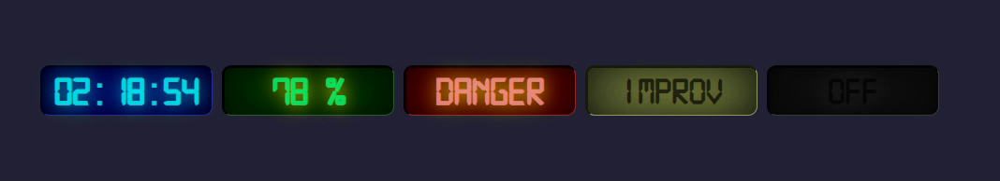

# RetroLED

Real feels of old 7 segments LCD displays. Counters displays, dashboards, automation and similars. Referenced by old 80's and 90's devices . Pure CSS.


## Authors

- [@andernunes](https://www.github.com/andernunes)


## Installation
Add LCD font CDN reference in your HEAD block:
```html5
<link href="https://fonts.cdnfonts.com/css/digital-7-mono" rel="stylesheet">
```
Just add CSS code to your base file.

```css
.led-blue {
  width: 180px;
  height: 50px;
  background-color: rgb(0,0,128);
  text-align:center;
  line-height: 50px;
  font-size:32pt;
  border-top: 3px solid #000000cc;
  border-left: 3px solid #000000cc;
  border-bottom: 1px solid #cfcfcf33;
  border-right: 1px solid #cfcfcf33;
  border-radius: 10px;
  box-shadow: 0px 0px 50px #000000ee inset;
  text-shadow: 0px 0px 20px #00ffffcc;
  margin: 5px;
  color: #00ffffcc;
}


.led-green {
  width: 180px;
  height: 50px;
  background-color: rgb(0,64,0);
  text-align:center;
  line-height: 50px;
  font-size:32pt;
  border-top: 3px solid #000000ee;
  border-left: 3px solid #000000ee;
  border-bottom: 1px solid #cfcfcf33;
  border-right: 1px solid #cfcfcf33;
  border-radius: 10px;
  box-shadow: 0px 0px 50px #000000ee inset;
  text-shadow: 0px 0px 20px #ffff00cc;
  margin: 5px;
  color: #00ff77cc;
}


.led-red {
  width: 180px;
  height: 50px;
  background-color: rgb(128,0,0);
  text-align:center;
  line-height: 50px;
  font-size:32pt;
  border-top: 3px solid #000000ee;
  border-left: 3px solid #000000ee;
  border-bottom: 1px solid #cfcfcf33;
  border-right: 1px solid #cfcfcf33;
  border-radius: 10px;
  box-shadow: 0px 0px 50px #000000ee inset;
  text-shadow: 0px 0px 20px #ffff00cc;
  margin: 5px;
  color: #ff9999cc;
}

.led-old {
  width: 180px;
  height: 50px;
  background-color: rgb(127,138,70);
  text-align:center;
  line-height: 50px;
  font-size: 40px;
  border-top: 3px solid #000000ce;
  border-left: 3px solid #000000ce;
  border-bottom: 1px solid #cfcfcf33;
  border-right: 1px solid #cfcfcf33;
  border-radius: 10px;
  box-shadow: 0px 0px 50px #000000ee inset;
  text-shadow: 0px 0px 20px #ffff0022;
  margin: 5px;
  color: #000000aa;
  
}

.led-off {
  width: 180px;
  height: 50px;
  background-color: rgb(20,20,20);
  text-align:center;
  line-height: 50px;
  font-size: 40px;
  border-top: 3px solid #000000ce;
  border-left: 3px solid #000000ce;
  border-bottom: 1px solid #cfcfcf33;
  border-right: 1px solid #cfcfcf33;
  border-radius: 10px;
  box-shadow: 0px 0px 50px #000000ee inset;
  text-shadow: 0px 0px 20px #55555544;
  margin: 5px;
  color: #000000aa;
  overflow: hidden;
}
```
HTML5 examples:

```html5
<div id="clock" class="led-blue">88:88:888</div>
<div id="humidity" class="led-green">78 %</div>
<div id="stat" class="led-red">DANGER</div>
<div id="rds" class="led-old">88888888</div>
<div id="ununsed" class="led-off">OFF</div>
```

Result


## Screenshots



